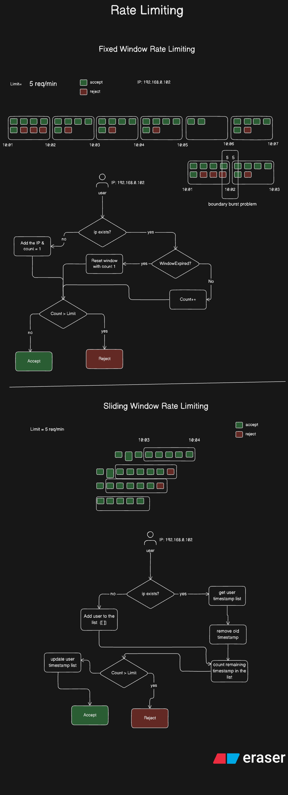

# **Rate Limiting**

Rate limiting is a technique used to control how many requests a user, client, or IP address can make to a server within a specific period of time. It helps **protect APIs** and **servers** from abuse, excessive load, or denial-of-service (DoS) attacks.

**Purpose of Rate Limiting:**

* Prevents server overload and ensures system stability.
* Protects against brute-force or spam attacks.
* Ensures fair usage among users.
* Helps maintain consistent application performance.

**Example:**
If an API has a rate limit of **5 requests per minute**, then a user can only send up to **5 requests** within any 60-second window. Any additional requests will be **rejected** until the next window begins.

---

## **Fixed Window Rate Limiting**

In **Fixed Window Rate Limiting**, time is divided into **fixed-size intervals** (for example, every 1 minute).
Each client or IP can make a **limited number of requests** within each interval. Once the limit is reached, any additional requests are rejected until the next window starts.

**How It Works:**

1. Divide time into fixed windows (e.g., each minute).
2. Maintain a counter for each user or IP address.
3. If the number of requests in the current window ≤ limit → accept the request.
4. If it exceeds the limit → reject the request.
5. When the window resets, the counter resets too.

**Example:**
Limit = 5 requests/min

* Between **10:01 – 10:02** → user can send 5 requests.
* Between **10:02 – 10:03** → counter resets; user can send another 5 requests.

**Issue:**
The **boundary burst problem** — a user can send 5 requests at the end of one window and 5 more immediately at the start of the next window, effectively making 10 requests in a very short time.

---

## **Sliding Window Rate Limiting**

The **Sliding Window** algorithm solves the boundary burst issue by using a **continuously moving window** instead of fixed time blocks. It tracks the **timestamps of each request** and only allows requests that fall within the **last N seconds/minutes**.

**How It Works:**

1. For each user, store the timestamps of their requests.
2. When a new request arrives:

   * Remove timestamps older than the current time minus the window size.
   * Count remaining requests within the valid time frame.
3. If the count < limit → accept the request and record the new timestamp.
4. If the count ≥ limit → reject the request.

**Example:**
Limit = 5 requests per 60 seconds

* If the user has made 5 requests in the last 60 seconds, the 6th one is rejected.
* Once the earliest request timestamp becomes older than 60 seconds, it’s removed, allowing a new request.

**Advantage:**
Provides a **more accurate and fair** rate limiting mechanism by ensuring a consistent request rate over time rather than in rigid intervals.

---

## **Difference Between Fixed Window and Sliding Window Rate Limiting**

| Feature                       | **Fixed Window**                                        | **Sliding Window**                                       |
| ----------------------------- | ------------------------------------------------------- | -------------------------------------------------------- |
| **Time Window Type**          | Fixed intervals (e.g., every 1 minute)                  | Continuously moving time window                          |
| **Tracking Method**           | Simple counter per user/IP                              | List or queue of timestamps                              |
| **Accuracy**                  | Less accurate; can cause bursts near window boundaries  | Highly accurate and smooth rate control                  |
| **Performance**               | Lightweight and faster                                  | Slightly heavier due to timestamp management             |
| **Implementation Complexity** | Easy to implement                                       | More complex                                             |
| **Use Case**                  | Suitable for low-traffic systems or less strict control | Ideal for high-traffic systems requiring precise control |
| **Example Issue**             | Boundary burst problem                                  | No burst issue, consistent rate enforcement              |

---

### **System Design**

